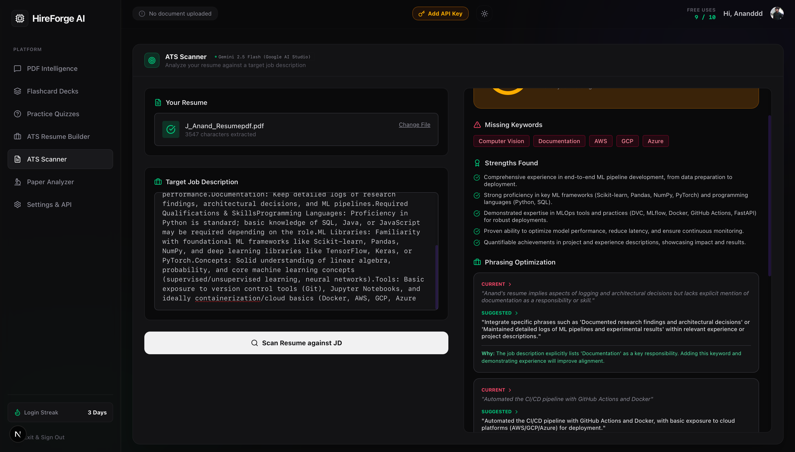

# HireForge AI

HireForge AI is an advanced, all-in-one educational and career development platform powered by state-of-the-art Large Language Models (LLMs). The platform is designed to bridge the gap between academic study and professional career preparation by offering a comprehensive suite of AI tools that analyze documents, generate study materials, and hyper-optimize resumes for Applicant Tracking Systems (ATS).

## 🚀 Key Features

### 📄 ATS Resume Editor (Live Preview)
An interactive AI-powered resume builder designed to beat ATS systems.
- **PDF Parsing:** Upload your existing PDF resume, and the system instantly extracts the text and reconstructs it into a beautiful, professional LaTeX template.
- **AI Modification Engine:** Paste a target Job Description. The AI acts as a professional resume writer, suggesting high-impact, keyword-rich bullet point replacements.
- **One-Click Patching:** Click "Apply" on any suggestion to instantly modify your resume's source code.
- **Live Preview & Export:** Watch your resume update in real-time on the split-screen visual preview. Download the perfectly formatted PDF instantly.

### 🔬 Research Paper Analyzer
A dedicated tool for AI researchers and computer science students.
- **Deep Document Analysis:** Upload complex academic papers (e.g., "Attention Is All You Need").
- **14-Point Breakdown:** The AI extracts the core methodology, architecture, problem statements, and key equations.
- **Instant Code Implementation:** The system writes a complete, runnable Google Colab/Jupyter Notebook (PyTorch) based solely on the paper's architecture, locked safely inside a premium syntax-highlighted dual-pane editor.

### 📚 Study & PDF Intelligence
- **AI Tutor:** Chat with an intelligent tutor that answers questions based *only* on the context of your uploaded textbooks or lecture slides.
- **Flashcards & Quizzes:** Automatically generate interactive study decks and multiple-choice quizzes to test your knowledge retention.

---

## 🧠 Detailed Project Explanation

HireForge AI is built as a unified learning-and-career workspace that turns raw documents into structured, actionable outputs. The platform follows a consistent pipeline across its tools: upload a document, extract clean text using client-side PDF parsing, and then pass structured prompts to LLMs so users get outputs that are immediately usable inside the UI (not just plain text).

1. **ATS Resume Editor Workflow**  
Users upload an existing resume PDF, which is parsed and restructured into a clean, editable format. When a target job description is pasted, the AI generates focused, keyword-rich bullet replacements. Each suggestion can be applied in one click, and the resume preview updates instantly for confidence before export.

2. **Research Paper Analyzer Workflow**  
Academic PDFs are summarized into a 14-point breakdown that covers methodology, architecture, and key ideas. The analysis is paired with an auto-generated notebook-style implementation so researchers can move from theory to runnable code quickly.

3. **Study & PDF Intelligence Workflow**  
Learners can upload textbooks or notes and ask context-bound questions. The same source content is used to generate flashcards and quizzes, helping reinforce understanding with structured study material instead of generic answers.

---

## 📸 Visual Proof & Demos

### 1. Landing Page & Dashboard Experience (Screen Recording)
Proof of the landing page UI and overall experience.

<video width="100%" controls>
  <source src="./public/landing_page_demo.mov" type="video/mp4">
  Your browser does not support the video tag. Please check the `public/landing_page_demo.mov` file in the repository.
</video>

*(If the video doesn't play automatically on GitHub, you can download or view it directly here: [Landing Page Demo](./public/landing_page_demo.mov))*

### 2. Research Paper Analyzer (Screen Recording)
Proof of the paper analysis and code-generation workflow.

<video width="100%" controls>
  <source src="./public/research_paper_analysis.mov" type="video/mp4">
  Your browser does not support the video tag. Please check the `public/research_paper_analysis.mov` file in the repository.
</video>

*(If the video doesn't play automatically on GitHub, you can download or view it directly here: [Paper Analysis Demo](./public/research_paper_analysis.mov))*

### 3. ATS Resume Editor (Screenshot)
Proof of the ATS resume editor interface.

---

## 🛠️ Tech Stack
- **Frontend:** Next.js, React, Tailwind CSS, Framer Motion, Lucide Icons
- **AI Models:** Google Gemini 2.5 Flash/Pro, Meta Llama 3.3, Qwen Coder (via Native APIs & OpenRouter)
- **Document Processing:** Client-side PDF parsing (PDF.js)
- **Formatting:** React-Markdown, Remark-Math, Rehype-Katex, React-Syntax-Highlighter
- **Database & Authentication:** Clerk, Supabase (PostgreSQL)

## 💻 Getting Started

1. Clone the repository
2. Install dependencies: `npm install`
3. Set up your `.env.local` with Clerk and Supabase keys
4. Run the development server: `npm run dev`
5. Open [http://localhost:3000](http://localhost:3000) in your browser
